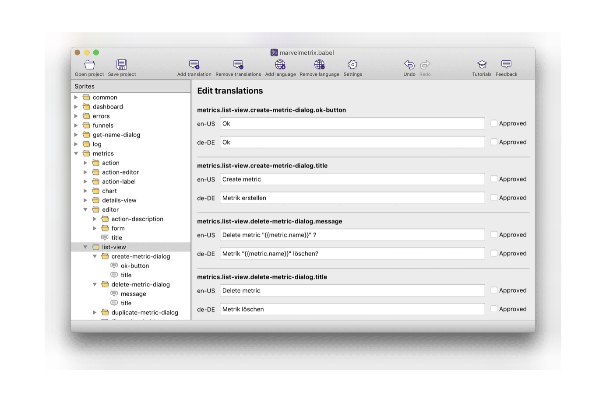

# Gatsby mdx test project to reproduce a bug in gatsby-bug-remark-images

Demonstrates a bug in Gatsby 3 where the background is not properly removed from images after
blur-up in an mdx file.

It seems that `onRouteUpdate` is not properly called in the plugin's `gatsby-browser.js`

A workaround is to add the following line to your own `gatsby-browser.js`:

    exports.onRouteUpdate = require("gatsby-remark-images/gatsby-browser").onRouteUpdate;

